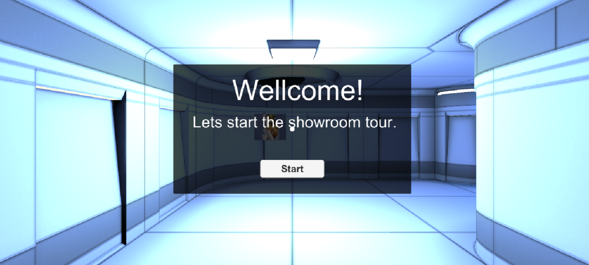
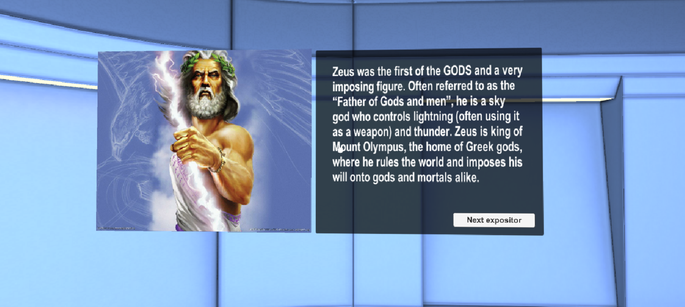
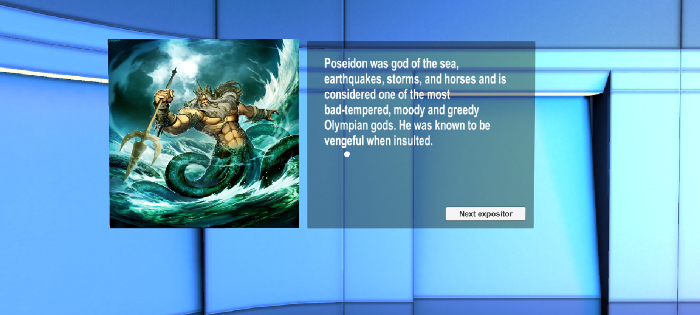
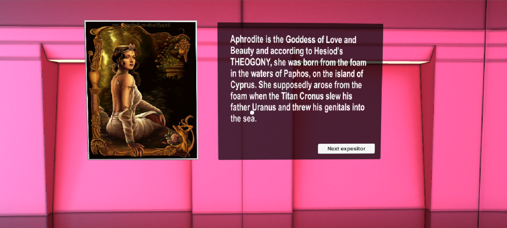
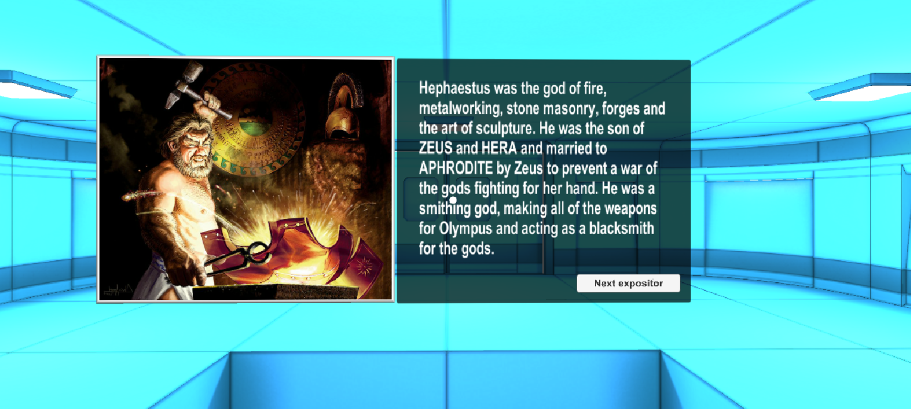
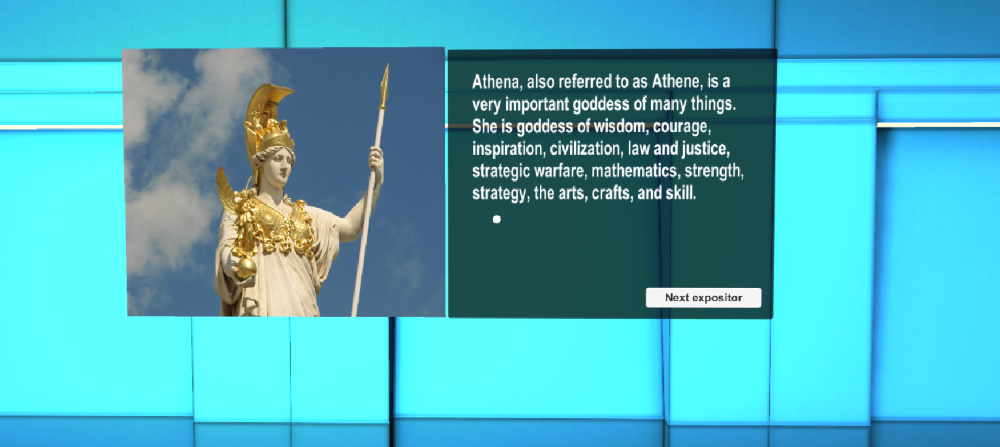
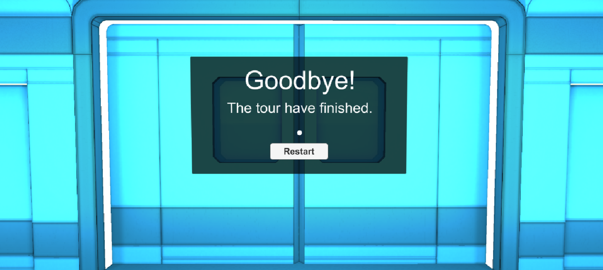
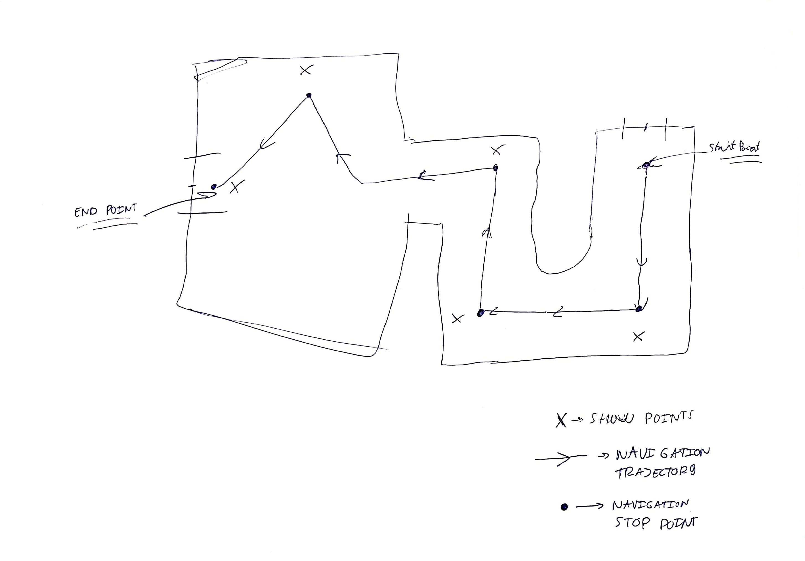
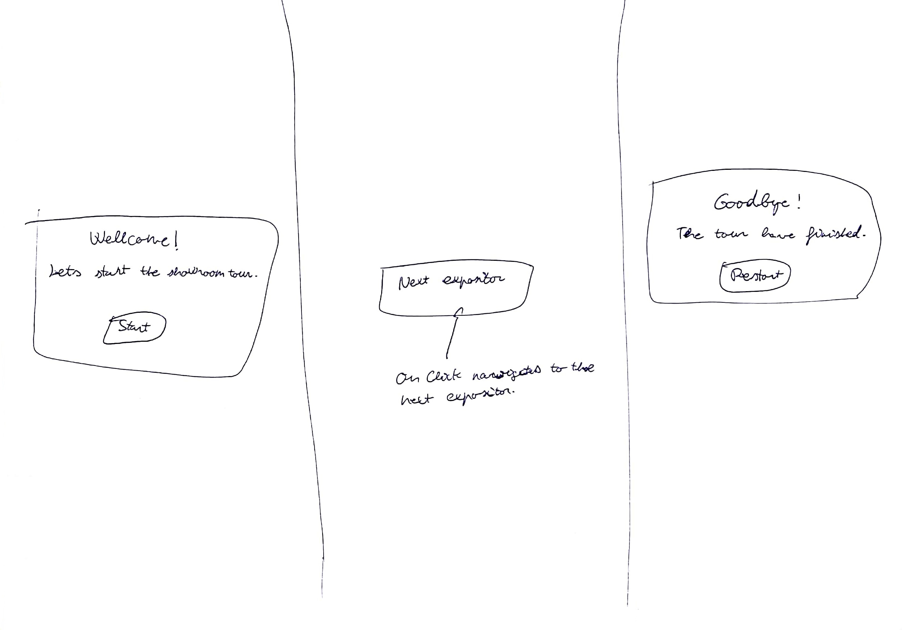

# Virtual Reality Showroom Project

## Introduction

This project is part of [Udacity](https://www.udacity.com "Udacity - Be in demand")'s [VR Developer Nanodegree](https://www.udacity.com/course/vr-developer-nanodegree--nd017).

The project consists on design and implement a Virtual Reality (VR) application, to immerse the user in a Virtual Reality state of the art showroom.

This work is developed using Unity and GoogleVR, with the aim of learn about VR design, VR development and VR project management. I have chosen as showroom theme: Greek Mythology Gods. I have decided to ambient the application in a showroom to focus the attention of the user to the content.

This document contains the specifications of the mentioned application and some information about the project schedule.

## Project Repository

[Virtual Reality Showroom Project GitHub Repository.](https://github.com/xavisolesoft/UdacityVR_Showroom)

## Demo video

## Scenes

### Start Scene

The start scene is the first place where the player will appear, so have the goal to immerse the user to a Greek mythology room with epic sounds.

### Zeus Scene

The play scene must focus the player to the Zeus picture and description, immersing the user using thunder sounds.

### Poseidon Scene

The play scene must focus the player to the Poseidon picture and description, immersing the user with sea sounds.

### Aphrodite Scene

The play scene must focus the player to the Aphrodite picture and description, immersing the user with "Oh, Pretty Woman" song and red sexy light.

### Hephaestus Scene

The play scene must focus the player to the Hephaestus picture and description, immersing the user with blacksmith hammer sounds.

### Athena Scene

The play scene must focus the player to the Athena picture and description, immersing the user with battle sounds.

### End Scene

The end scene appears when the user have completed the tour. We give the user the opportunity to restart the tour and play for the user the funniest song used in this tour "Oh, Pretty Woman".

## Project Schedule

### Iteration 1: Analysis

This iteration consisted of analyze the potential players for our game, design the scenes and the GUI.

#### Persona

Jordi, 25 - Computer Science, University Student

“I love gaming”

Jordi is a videogame passionate. He is studying Computer Science at the university to become an excellent video game developer.

VR experience: Tried only once in a university VR demo.

#### Game Sketch

#### GUI Sketch

### Iteration 2: Scene

This iteration consisted of implement the 3D scene and the lighting.

#### Find a prebuilt 3D scene

This step consisted on search some showroom free prebuilt scenes using google to find one that is compatible with the project specification and performance requirements.

#### Test questions for the definitive scene integration

- There is any object that is oversized, undersized?
  - No.
- How do you feel with the atmosphere of the game? Where do you thing are you placed?
  - I'm immersed in a Greek mythology showroom.
- There is any object that is not correctly visualized?
  - No.
- Do you see any zone that is too dark appreciate it?
  - In general the light is too low for a showroom.
- Do you see any zone that is too shiny and causes you sickness?
  - No.

#### Test feedback modifications

The spot lights range and intensity was incremented to give a better showroom experience.

### Iteration 3: GUI

This iteration consisted of implement the start and restart GUI dialogs.

#### Test questions

- Can you read comfortably the text of the dialogs?
  - "The tour have finished." text seems fuzzy at Restart Dialog.
- Do you understand what the button does when is clicked?
  - Yes.

#### Test feedback modifications

The text "The tour have finished." style was edited to improve the readability.

### Iteration 4: Navigation system

This iteration consisted of implement the player navigation system.

#### Test questions

- Does it feel like you are going to hit a wall?
  - No.
- The movement causes you sickness or makes the environment look fuzzy?
  - Yes, I the move speed is too high for me.

#### Test feedback modifications

The position and rotation speed was decreased to give a more comfortable experience to the user.

### Iteration 5: Expositions

This iteration consisted of build the showroom expositors.

#### Test questions

- Are the size of the god pictures correctly?
  - Yes.
- Can you read correctly the text?
  - Yes.
- Do you know how to pas to the next expositor?
  - Yes, I have to click the "Next expositor" button.

#### Test feedback modifications

All the tests got green for this iteration, nothing to change.

### Iteration 6: Sounds

This iteration consisted of build all the sound mechanic.

#### Test questions

- Do you listen all the sound tracks correctly?
  - Yes.
- The sound tracks are representing correctly each god?
  - Yes.

#### Test feedback modifications

All the tests got green for this iteration, nothing to change.

#### Test feedback modifications

The tester understood the game mechanics and only fail 3 times. Nothing to modify on this testing iteration.

## Conclusion

This project have given me the opportunity to learn about Virtual Reality Design, gaining practical experience on all the steps of a Virtual Reality project.

As future work, we could adapt the controls to other Virtual Reality platforms that use a joystick controller like Google Day Dream. With this approach, the experience could be more ergonomic for the users, they could move the pointer with out move their head, only moving the joystick. This new feature could reduce the simulation sickness produced by unnecessary head movements.

## References

- [God description texts](https://greekgodsandgoddesses.net/)
- [Zeus image](http://es.campamentomestizofanon.wikia.com/wiki/Zeus)
- [Poseidon image](https://genzoman.deviantart.com/art/Poseidon-God-of-the-Sea-484552876)
- [Aphrodite image](http://majorolympians.com/aphrodite.html)
- [Hephestus image](https://www.emaze.com/@AFCZQQFQ/Greek-gods-and)
- [Athena image](http://eskipaper.com/athena-1.html#gal_post_70960_athena-1.jpg)
- [Scene model](https://assetstore.unity.com/packages/3d/environments/3d-free-modular-kit-85732)
- [Zeus thunder soundstrack](https://assetstore.unity.com/packages/audio/sound-fx/thunder-sound-set-volume-1-56530)
- [Poseidon sea soundtrack](http://soundbible.com/1936-Crisp-Ocean-Waves.html)
- [Aphodite Pretty Woman song](https://musicpleer.bz/#!af539b2dd28467733c183854cc8bd5b3)
- [Hephaestus Hammering Metal sountrack](https://retired.sounddogs.com/sound-effects/blacksmith-hammering-metal-sledgehammer-299566)
- [Athena Battle sountrack](https://retired.sounddogs.com/previews/42/mp3/432291_SOUNDDOGS__ba.mp3)
- [Start Epic soundtrack](http://www.beatsuite.com/music/category/epic/372)

## Third Party Software

- [Unity 2017.2.0f3](https://unity3d.com/es/get-unity/download/archive)
- [GVR Unity SDK v1.70.0](https://github.com/googlevr/gvr-unity-sdk/releases)
- [iTween v2.0.8](https://assetstore.unity.com/packages/tools/animation/itween-84)