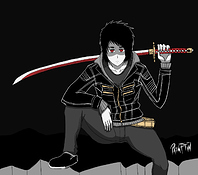

# Virtual Reality Showroom Project

## Introduction

This project is part of [Udacity](https://www.udacity.com "Udacity - Be in demand")'s [VR Developer Nanodegree](https://www.udacity.com/course/vr-developer-nanodegree--nd017).

The project consists on design and implement a Virtual Reality (VR) application, to immerse the user in a Virtual Reality state of the art showroom.

This work is developed using Unity and GoogleVR, with the aim of learn about VR design, VR development and VR project management. I have decided to ambient the application in a showroom to focus the attention of the user to the content.

This document contains the specifications of the mentioned application and some information about the project schedule.

## Project Repository

[Virtual Reality Showroom Project GitHub Repository.](https://github.com/xavisolesoft/UdacityVR_Showroom)

## Demo video

TODO

## Scenes

### Start Scene

The start scene is the first place where the player will appear, so have the goal to immerse the user to the Ancient Egypt, showing: great pyramids, pharaoh statues and the desert.

### Play Scene

The play scene must focus the player to the simon puzzle game, so it's a closed small dungeon with reduced illumination and no distractions.

### End Scene

The end scene appears when the player have won the game, so the face of the pharaoh appears to congratulate the player, inviting the player to visit the pharaoh great pyramid. The player can restart the game.

## Project Schedule

### Iteration 1: Analysis

This iteration consisted of analyze the potential players for our game, design the scenes and the GUI.

#### Persona

Jordi, 25 - Computer Science, University Student

“I love gaming”

Jordi is a videogame passionate. He is studying Computer Science at the university to become an excellent video game developer.

VR experience: Tried only once in a university VR demo.

#### Game Sketch

#### GUI Sketch

### Iteration 2: Scene

This iteration consisted of implement the 3D scene and the lighting.

#### Find a prebuilt 3D scene

This step consisted on search some showroom free prebuilt scenes using google to find one that is compatible with the project specification and performance requirements.

#### Test questions for the definitive scene integration

- There is any object that is oversized, undersized?
  - No.
- How do you feel with the atmosphere of the game? Where do you thing are you placed?
  - I'm immersed in an showroom.
- There is any object that is not correctly visualized?
  - No.
- Do you see any zone that is too dark appreciate it?
  - In general the light is too low for a showroom.
- Do you see any zone that is too shiny and causes you sickness?
  - No.

#### Test feedback modifications

The spot lights range and intensity was incremented to give a better showroom experience.

### Iteration 3: GUI

This iteration consisted of implement the start and restart GUI dialogs.

#### Test questions

- Can you read comfortably the text of the dialogs?
  - "The tour have finished." text seems fuzzy at Restart Dialog.
- Do you understand what the button does when is clicked?
  - Yes.

#### Test feedback modifications

The text "The tour have finished." style was edited to improve the readability.

### Iteration 4: Navigation system

This iteration consisted of implement the player navigation system.

#### Test questions

- Does it feel like you are going to hit a wall?
  - No.
- The movement causes you sickness or makes the environment look fuzzy?
  - Yes, I the move speed is too high for me.

#### Test feedback modifications

The position and rotation speed was decreased to give a more comfortable experience to the user.

### Iteration 5: Game mechanic

This iteration consisted of implement the puzzle orbs behavior and sounds.

#### Test questions

- Do you understand what to do with the orbs?
  - Yes, I have to pick them with the same sequence showed at the begin.
- Is the orb sequence demonstration too quick or slow for you?
  - It's right for me.
- Do you finished the game?
  - Yes.
- How many fails you got?
  - 3.

#### Test feedback modifications

The tester understood the game mechanics and only fail 3 times. Nothing to modify on this testing iteration.

## Conclusion

This project have given me the opportunity to learn about Virtual Reality Design, gaining practical experience on all the steps of a Virtual Reality project.

As future work, we could adapt the controls to other Virtual Reality platforms that use a joystick controller like Google Day Dream. With this approach, the experience could be more ergonomic for the users, they could move the pointer with out move their head, only moving the joystick. This new feature could reduce the simulation sickness produced by unnecessary head movements.
